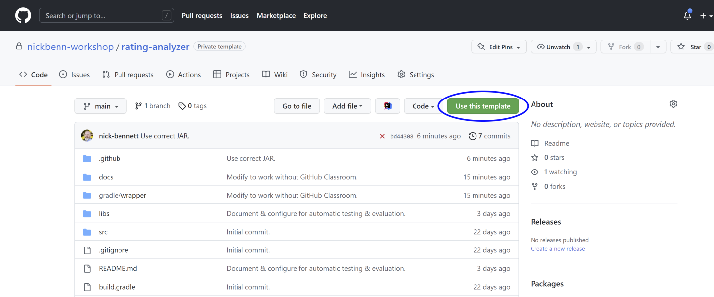
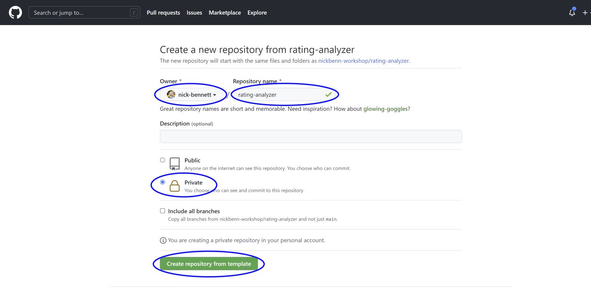
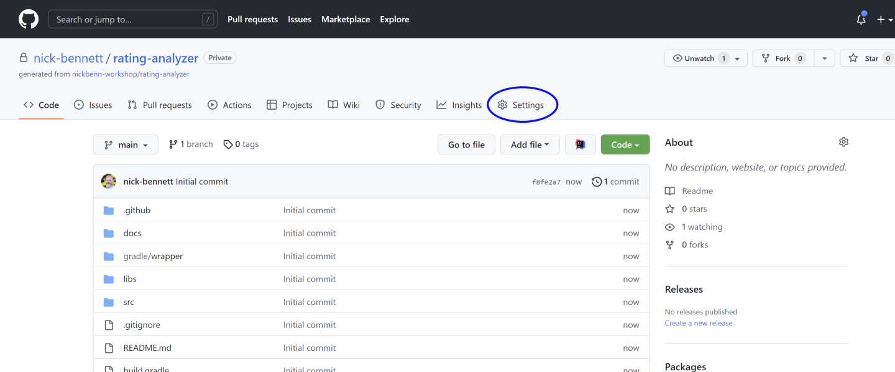
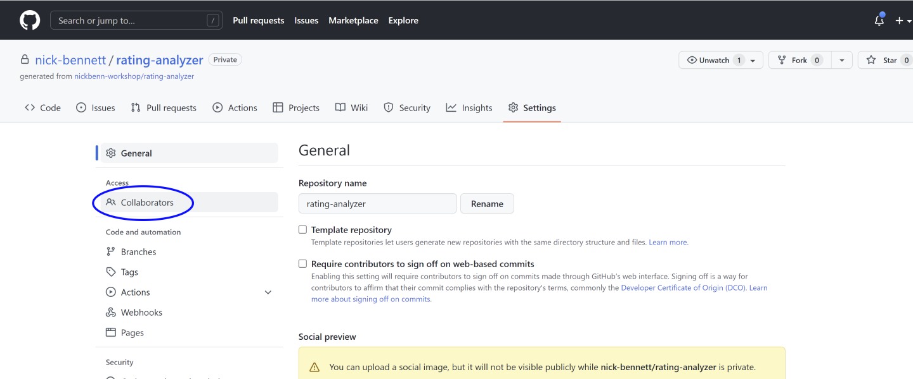
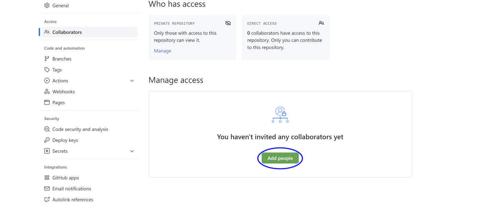
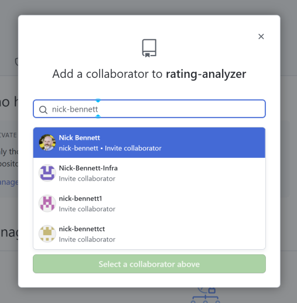
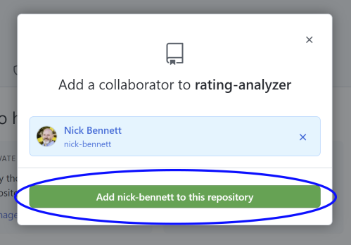
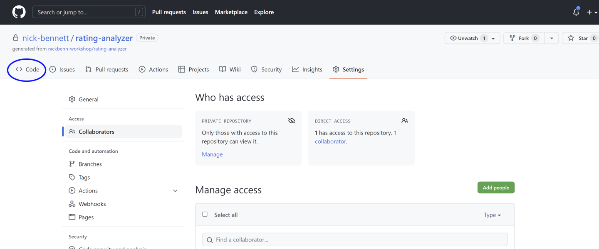




# {{ page.title }}
{:.no_toc}

To create and configure your repository for this assignment:

1. Click [here]({{ template }}){:target='_blank'} or on the **Template** link, above, to browse to the template repository you'll be using.

2. Click the **Use this template** button.

   

3. In the **Create a new repository from `rating-analyzer`**, set the following values:

    * In the **Owner** pull-down, select your personal account.
    * For **Repository name**, type (or paste) `rating-analyzer`. (Please note the spelling, letter-casing, and the hyphen between the words.)
    * Select the **Private** option.
    * Click the **Create repository from template** button.

   

4. The next page displays your new repository, created from the template. Click the **Settings** tab.

    

5. In the settings page, click the **Collaborators** link in the left sidebar.

   

6. In the next page, click the **Add people** button in the **Manage access** section.

    

7. Type (or paste) `nick-bennett` in the search field. There are several GitHub users with similar usernames, so be sure to click on the one spelled exactly that way (and with the gray beard in the avatar photo).

   

8. With the instructor selected as a collaborator, click the **Add nick-bennett to this repository** button.

   

9. Click on the **Code** tab to prepare to clone the repository to your local system.

   
